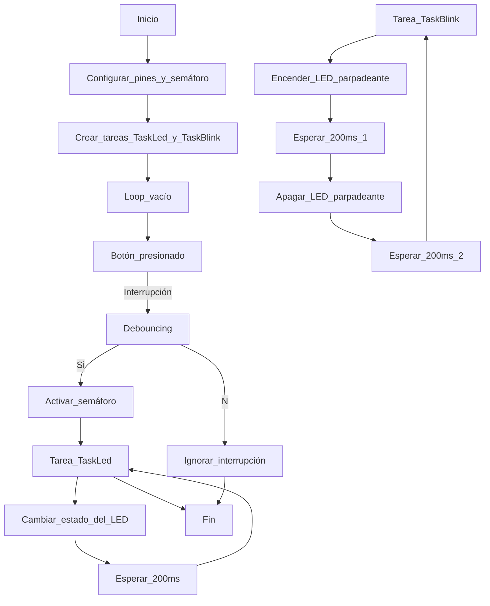
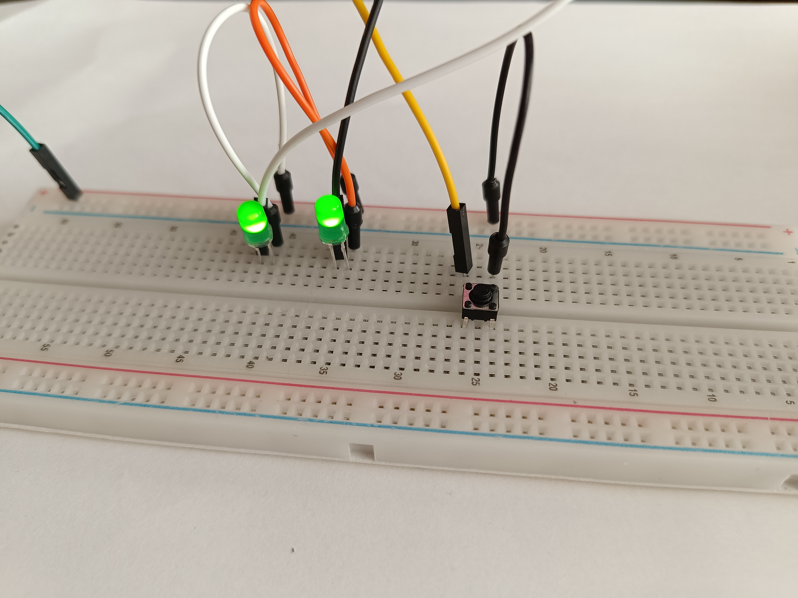

# Practica 4: Sistemas operativos a tiempo real (LEDs)
## Objetivos: 
- Realizar un programa que utilice dos tareas 
- Un tarea enciende y apaga un LED en bucle
- Otra tarea enciende y apaga otro LED a partir de una interrupción.
## Materiales:
- ESP32-S3
- 2 LEDs (verdes)
- Botón
## Procedimiento:
**Código:**
```cpp
    #include <Arduino.h>
    #include <semphr.h>

    SemaphoreHandle_t interruptSemaphore;

    void TaskLed(void *pvParameters);
    void TaskBlink(void *pvParameters);
    void debounceInterrupt();

    const int buttonPin = 2; // Pin del botón
    const long debouncing_time = 150; // Tiempo de rebote del botón en milisegundos

    void setup() {
    Serial.begin(115200); // Iniciar comunicación serial
    
    pinMode(buttonPin, INPUT_PULLUP); // Configurar el pin del botón como entrada con pull-up
    pinMode(8, OUTPUT); // Configurar el pin 8 como salida para el LED controlado por la tarea TaskLed
    pinMode(7, OUTPUT); // Configurar el pin 7 como salida para el LED parpadeante controlado por la tarea TaskBlink

    interruptSemaphore = xSemaphoreCreateBinary(); // Crear semáforo binario
    if (interruptSemaphore != NULL) {
        attachInterrupt(digitalPinToInterrupt(buttonPin), debounceInterrupt, FALLING); // Asociar la interrupción al botón
    }
    
    xTaskCreate(TaskLed,  "Led", 5000, NULL, 1, NULL); // Crear tarea para controlar el LED
    xTaskCreate(TaskBlink,  "LedBlink", 5000, NULL, 2, NULL); // Crear tarea para el LED parpadeante
    }

    void loop() {}

    void interruptHandler() {
    xSemaphoreGiveFromISR(interruptSemaphore, NULL);
    }

    void TaskLed(void *pvParameters) {
    (void) pvParameters;
    for (;;) {
        if (xSemaphoreTake(interruptSemaphore, portMAX_DELAY) == pdPASS) {
        bool ledState = digitalRead(8);
        digitalWrite(8, !ledState); // Cambiar el estado del LED controlado por TaskLed
        Serial.println("LED controlado por TaskLed encendido/apagado");
        }
        vTaskDelay(200);
    }
    }

    void TaskBlink(void *pvParameters) {
    (void) pvParameters;
    for (;;) {
        digitalWrite(7, HIGH);
        vTaskDelay(200);
        digitalWrite(7, LOW);
        vTaskDelay(200);
    }
    }

    void debounceInterrupt() {
    static unsigned long last_interrupt_time = 0;
    unsigned long interrupt_time = millis();
    
    // Debouncing
    if (interrupt_time - last_interrupt_time > debouncing_time) {
        interruptHandler();
        Serial.println("Interrupción detectada");
        //delayMicroseconds(1000); // Incrementa el retardo aquí
    }
    last_interrupt_time = interrupt_time;
    }
```
**Descripción:**<br>
Controla dos LEDs, uno mediante una tarea y otro parpadeante. Además, incluye un manejo de interrupción para un botón que activa la tarea de control del LED.<br>
En la configuración inicial en la función ``setup()``, se establecen los pines de entrada y salida necesarios, se crea un semáforo binario para sincronizar la tarea de control del LED con la interrupción del botón, y se crean las dos tareas utilizando la función ``xTaskCreate()``.<br>
Las tareas ``TaskLed()`` y ``TaskBlink()`` son funciones que se ejecutan de forma independiente y periódica. La tarea ``TaskLed()`` cambia el estado de un LED basado en la activación del botón mediante la interrupción asociada a ``interruptSemaphore``. Mientras que ``TaskBlink()`` hace que otro LED parpadee continuamente.<br>
La función ``interruptHandler()`` se llama cuando se activa la interrupción del botón y da el semáforo para despertar a la tarea ``TaskLed()``.<br>
La función ``debounceInterrupt()`` se encarga de manejar el rebote del botón para evitar activaciones falsas. Cuando se detecta una interrupción, se verifica si ha pasado un tiempo superior al tiempo de rebote antes de manejarla.

**Diagrama de flujos:**

**Salida terminal:**
```
Interrupción detectada
LED controlado por TaskLed encendido/apagado
Interrupción detectada
LED controlado por TaskLed encendido/apagado
```
## Foto montaje: 


## Conclusión: 
Uno se enciende o apaga mediante un botón, utilizando una tarea específica, y el otro parpadea de manera continua utilizando otra tarea. Se implementa un manejo de interrupción para el botón con el fin de evitar rebotes.